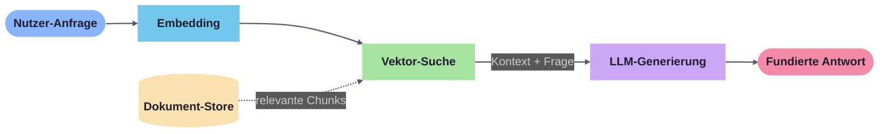

# Retrieval-Augmented Generation (RAG)

### Intelligente Suche mit Vektordatenbanken aufbauen


---

# Was ist RAG?

**Retrieval-Augmented Generation** kombiniert:

1. **Information Retrieval** - Relevante Dokumente finden
2. **Language Models** - Menschenähnliche Antworten generieren

> "Gib dem LLM den Kontext, den es braucht, anstatt sich darauf zu verlassen, was es während des Trainings gelernt hat"

---

# Warum RAG?

### Probleme mit reinen LLMs

- 🧠 **Stichtag** - Trainingsdaten haben ein Zeitlimit
- 🎭 **Halluzinationen** - Selbstbewusst falsche Antworten
- 📦 **Keine privaten Daten** - Kein Zugriff auf Ihre Dokumente
- 💰 **Fine-Tuning ist teuer** - Erfordert erhebliche Ressourcen

---

# Warum RAG?

### RAG löst diese Probleme

- ✅ Aktuelles Wissen
- ✅ Basiert auf tatsächlichen Dokumenten
- ✅ Funktioniert mit privaten Daten
- ✅ Kein Modell-Retraining erforderlich

---

# RAG-Architektur-Überblick



---

# Die RAG-Pipeline

### Schritt-für-Schritt-Ablauf

1. **Ingest** - Dokumente laden und chunken
2. **Embed** - Chunks in Vektoren umwandeln
3. **Store** - In Vektordatenbank speichern
4. **Query** - Nutzer stellt eine Frage
5. **Retrieve** - Ähnliche Chunks finden
6. **Augment** - Prompt mit Kontext aufbauen
7. **Generate** - LLM erzeugt Antwort

---

# Schritt 1: Dokumenten-Chunking

### Warum Chunking?

- LLMs haben **Kontextfenster-Limits** (4K - 128K Token)
- Kleinere Chunks = **präziseres Retrieval**
- Größere Chunks = **mehr Kontext erhalten**

---

# Schritt 1: Dokumenten-Chunking

### Chunking-Strategien

| Strategie     | Beschreibung                 | Anwendungsfall   |
|---------------|------------------------------|------------------|
| Feste Größe   | Nach Zeichenanzahl teilen    | Einfach, schnell |
| Satz          | An Satzgrenzen teilen        | Erhält Bedeutung |
| Semantisch    | Nach Thema/Bedeutung teilen  | Beste Qualität   |
| Rekursiv      | Mehrere Strategien probieren | Ausgewogen       |

---

# Chunking: Die Überlappungsstrategie

```mermaid
%%{init: {'theme': 'dark', 'themeVariables': {'primaryColor': '#313244', 'primaryTextColor': '#cdd6f4', 'lineColor': '#6c7086', 'fontSize': '16px'}}}%%
flowchart TB
  D["<b>Dokument</b><br/><i>The quick brown fox jumps over the lazy dog.</i>"]

  D --> C1 & C2 & C3

  C1["<b>Chunk 1</b> — The quick brown <b>fox</b>"]
  C2["<b>Chunk 2</b> — <b>fox</b> jumps over <b>the</b>"]
  C3["<b>Chunk 3</b> — <b>the</b> lazy dog"]

  C1 -.-|"Überlappung: <b>fox</b>"| C2
  C2 -.-|"Überlappung: <b>the</b>"| C3

  classDef doc fill:#89b4fa,color:#1e1e2e,stroke:none,font-weight:bold
  classDef c1 fill:#313244,color:#cdd6f4,stroke:#a6e3a1,stroke-width:2px
  classDef c2 fill:#313244,color:#cdd6f4,stroke:#f9e2af,stroke-width:2px
  classDef c3 fill:#313244,color:#cdd6f4,stroke:#f38ba8,stroke-width:2px

  class D doc
  class C1 c1
  class C2 c2
  class C3 c3

  linkStyle 0,1,2 stroke:#585b70,stroke-width:2px
  linkStyle 3,4 stroke:#f9e2af,stroke-width:2px,stroke-dasharray:6
```



> **Faustregel**: 10-20% Überlappung verhindert Kontextverlust an Chunk-Grenzen

---

# Schritt 2: Embeddings

### Was sind Embeddings?

Embeddings sind **Vektorrepräsentationen** von Text, die semantische Bedeutung enthalten.

```
"coffee brewing"  → [0.12, -0.45, 0.78, 0.23, ...]
"making espresso" → [0.14, -0.42, 0.81, 0.19, ...]  ← Ähnlich!
"car engine"      → [-0.67, 0.32, -0.15, 0.89, ...] ← Unterschiedlich!
```

### Kernelement

Ähnliche Bedeutungen → Ähnliche Vektoren → Kleine Distanz

---

# Embedding-Modelle

| Modell                 | Dimensionen | Anbieter    |
|------------------------|-------------|-------------|
| text-embedding-3-small | 1536        | OpenAI      |
| text-embedding-3-large | 3072        | OpenAI      |
| nomic-embed-text       | 768         | Ollama      |
| all-MiniLM-L6-v2       | 384         | HuggingFace |

---

# Embedding-Modelle

### Überlegungen

- **Dimensionen** beeinflussen Speicher und Suchgeschwindigkeit
- **Qualität** variiert je nach Anwendungsfall
- **Lokal vs. API** - Abwägungen

---

# Schritt 3: Vektordatenbanken

### Warum keine regulären Datenbanken?

```sql
-- Das funktioniert nicht für semantische Suche!
SELECT * FROM documents
WHERE content LIKE '%coffee brewing%'
```
---

# Schritt 3: Vektordatenbanken

### Vektor-DB-Features

- 🔍 **Ähnlichkeitssuche** - Nächste Nachbarn finden
- 📊 **ANN-Algorithmen** - Approximate Nearest Neighbor
- 🏎️ **Optimierte Indizes** - HNSW, IVF, etc.
- 📈 **Skalierbarkeit** - Milliarden von Vektoren

---

# Vektordatenbank-Optionen

### Beliebte Optionen

<div class="columns">
<div class="col">

### Cloud/Managed
- Pinecone
- Weaviate Cloud
- Azure AI Search
- MongoDB Atlas

</div>
<div class="col">

### Self-Hosted
- **Qdrant** ⭐
- Milvus
- ChromaDB
- pgvector

</div>
</div>

---

# Vektor-Ähnlichkeitsmetriken

### Distanzfunktionen

| Metrik        | Formel     | Anwendungsfall              |
|---------------|------------|-----------------------------|
| Cosinus       | 1 - cos(θ) | Am häufigsten, normalisiert |
| Euklidisch    | √Σ(a-b)²   | Absolute Distanzen          |
| Skalarprodukt | Σ(a×b)     | Größenordnung wichtig       |

### Cosinus-Ähnlichkeit

```
sim(A, B) = (A · B) / (||A|| × ||B||)

Bereich: -1 bis 1 (1 = identisch)
```

---

# Schritt 4: Der Query-Prozess

```mermaid
%%{init: {'theme': 'dark', 'themeVariables': {'primaryColor': '#313244', 'primaryTextColor': '#cdd6f4', 'lineColor': '#6c7086', 'fontSize': '16px'}}}%%
flowchart LR
  Q(["How do I make espresso?"])
  E["Query embedden<br/><code>[0.12, -0.45, 0.78, …]</code>"]
  S[("Vektordatenbank<br/>Top K Chunks")]
  R["Relevanz-Ranking<br/>& Filterung"]

  Q --> E --> S --> R

  classDef query fill:#89b4fa,color:#1e1e2e,stroke:none,font-weight:bold
  classDef embed fill:#74c7ec,color:#1e1e2e,stroke:none,font-weight:bold
  classDef search fill:#f9e2af,color:#1e1e2e,stroke:none,font-weight:bold
  classDef rank fill:#a6e3a1,color:#1e1e2e,stroke:none,font-weight:bold

  class Q query
  class E embed
  class S search
  class R rank

  linkStyle default stroke:#585b70,stroke-width:2px
```



---

# Schritt 5: Kontext-Erweiterung

### Den Prompt aufbauen

```
System: Du bist ein hilfreicher Assistent. Verwende den folgenden
Kontext, um Fragen zu beantworten. Wenn der Kontext die
Antwort nicht enthält, sage "Ich weiß es nicht."

Kontext:
---
[Abgerufener Chunk 1: Espresso-Grundlagen...]
[Abgerufener Chunk 2: Druck und Temperatur...]
[Abgerufener Chunk 3: Wichtigkeit der Mahlgröße...]
---

Nutzer: How do I make espresso?
```

---

# Die RAG-Prompt-Vorlage

```csharp
var prompt = $"""
Du bist ein hilfreicher Assistent, der Fragen basierend auf
dem bereitgestellten Kontext beantwortet.

KONTEXT:
{string.Join("\n---\n", retrievedChunks)}

REGELN:
- Verwende nur Informationen aus dem obigen Kontext
- Falls unsicher, sage "Ich habe nicht genügend Informationen"
- Zitiere Quellen wenn möglich

NUTZERFRAGE: {userQuery}
""";
```

---

# Schritt 6: Generierung

### Das LLM macht seine Magie

- Liest den **erweiterten Prompt**
- Generiert eine **fundierte Antwort**
- Kann **Zitate** zu Quelldokumenten enthalten

### Beispielantwort

> "Um Espresso zuzubereiten, müssen Sie 9 Bar Druck
> und Wasser bei 90-96°C verwenden. Der Mahlgrad sollte extra-fein sein,
> und die Extraktion dauert 25-30 Sekunden für einen ordentlichen Shot."
> 
> *Quellen: espresso-basics.md*

---

# Wichtige RAG-Parameter

### Feinabstimmung für Qualität

| Parameter       | Beschreibung                   | Typ. Wert |
|-----------------|--------------------------------|-----------|
| **Chunk-Größe** | Zeichen pro Chunk              | 500-1000  |
| **Überlappung** | Gemeinsame Zeichen zw. Chunks  | 50-200    |
| **Top K**       | Anzahl der abzurufenden Chunks | 3-10      |
| **Min. Score**  | Relevanz-Schwelle              | 0.7-0.8   |

---

# Häufige RAG-Herausforderungen

### 1. Retrieval-Qualität

- Falsche Chunks abgerufen
- **Lösung**: Besseres Chunking, Hybrid-Suche

### 2. Lost in the Middle

- LLMs ignorieren mittleren Kontext
- **Lösung**: Reranking, Chunks limitieren

### 3. Kontextfenster-Limits

- Zu viele Chunks = Abschneiden
- **Lösung**: Zusammenfassung, Auswahl

---

# Fortgeschrittene Techniken

### Hybrid Search
Kombiniert Vektor-Ähnlichkeit + Keyword-Matching (BM25)

### Query Expansion
Schreibt Queries für besseres Retrieval um

### Hypothetical Document Embeddings (HyDE)
Generiert hypothetische Antwort, embeddet diese

### Reranking
Verwendet Cross-Encoder zum Neuordnen der Ergebnisse

---

# Multi-Model-Überlegungen

### Embedding-Modell-Collections

```
documents_nomic-embed-text     ← Ollama-Embeddings
documents_text-embedding-3-small ← OpenAI-Embeddings
```

> ⚠️ Unterschiedliche Modelle = Unterschiedliche Vektorräume
> 
> **Niemals Embeddings von verschiedenen Modellen mischen!**

---

# Demo-Architektur

```mermaid
%%{init: {'theme': 'dark', 'themeVariables': {'primaryColor': '#313244', 'primaryTextColor': '#cdd6f4', 'lineColor': '#6c7086', 'fontSize': '16px'}}}%%
flowchart LR
  subgraph FE["React Frontend"]
    direction TB
    UI["Chat UI"]
    CFG["Config"]
    PV["Pipeline Viewer"]
  end

  subgraph API[".NET 9 Web API"]
    direction TB
    ORCH["RAG Orchestrator"]
    CH["Chunker"]
    EMB["Embedder"]
    VS["Vector Store"]
    ORCH --> CH & EMB & VS
  end

  FE ==>|"HTTP / REST"| API
  ORCH -->|"LLM"| OL
  EMB -->|"Embed"| OL
  VS -->|"Vektoren"| QD

  OL[("Ollama — lokal")]
  QD[("Qdrant — Vektoren")]

  classDef fe fill:#89b4fa,color:#1e1e2e,stroke:none,font-weight:bold
  classDef api fill:#a6e3a1,color:#1e1e2e,stroke:none,font-weight:bold
  classDef orch fill:#cba6f7,color:#1e1e2e,stroke:none,font-weight:bold
  classDef ext fill:#f9e2af,color:#1e1e2e,stroke:none,font-weight:bold

  class UI,CFG,PV fe
  class CH,EMB,VS api
  class ORCH orch
  class OL,QD ext

  linkStyle default stroke:#585b70,stroke-width:2px
```



---

# Demo: Konfigurationswechsel

### Anbieter

```json
{
  "AI": {
    "Provider": "Ollama",  // oder "OpenAI"
    "Ollama": {
      "Endpoint": "http://localhost:11434",
      "ChatModel": "llama3.2",
      "EmbeddingModel": "nomic-embed-text"
    }
  }
}
```

---

# Demo: Dokumenten-Ingestion

### Upload → Chunk → Embed → Store

```csharp
// 1. Dokument chunken
var chunks = _chunker.Chunk(document);

// 2. Embeddings generieren
var embeddings = await _embedder.EmbedAsync(chunks);

// 3. In Vektordatenbank speichern
await _vectorStore.UpsertAsync(chunks);
```

---

# Demo: Query-Pipeline

1. **Query**: "What's the difference between espresso and pour-over?"
2. **Embed**: In Vektor umwandeln
3. **Search**: Top 5 ähnliche Chunks finden
4. **Score**: Relevanz-Scores anzeigen
5. **Augment**: Kontext aufbauen
6. **Generate**: Antwort streamen

---

# Best Practices

<div class="columns">
<div class="col">
✅ Gut

- Verschiedene Chunk-Größen testen
- Relevanz-Scores überwachen
- Passende Embedding-Modelle verwenden
- Caching implementieren
- Alles für Debugging loggen
</div>
<div class="col">
❌ Schlecht

- Embedding-Modelle mischen
- Kontextfenster-Limits ignorieren
- Relevanzfilterung überspringen
- Rate-Limits vergessen
</div>
</div>

---

# Ressourcen

### Dokumentation
- [Microsoft.Extensions.AI: https://github.com/dotnet/extensions](https://github.com/dotnet/extensions)
- [Qdrant Documentation: https://qdrant.tech/documentation/](https://qdrant.tech/documentation/)
- [Ollama Models: https://ollama.ai/library](https://ollama.ai/library)
- u.v.m.

### Demo Repository
- https://github.com/AliMoinzadeh/Dojo.RAG

---

# Fragen?
