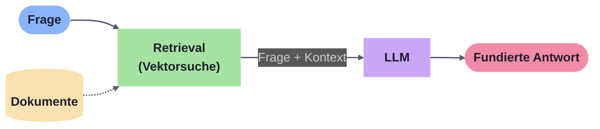
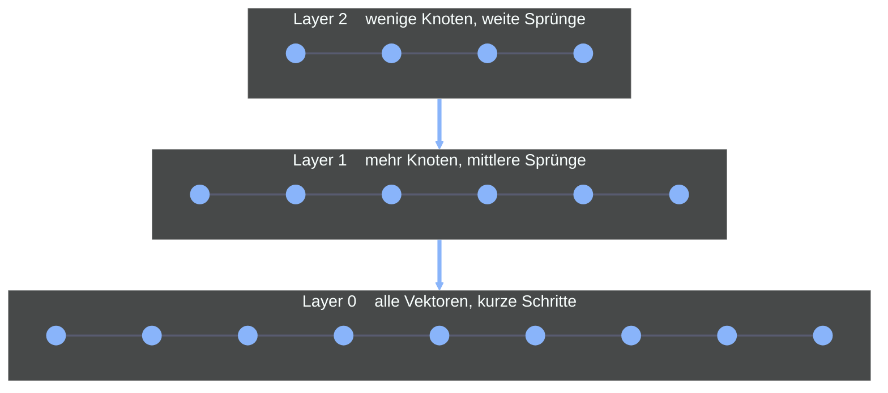
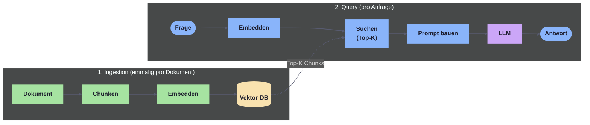
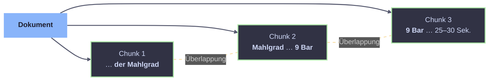

<!-- _class: title -->

# RAG & Vektorsuche

## Wie LLMs lernen, in *euren* Daten zu suchen

---

# Das Problem

Ein LLM allein kennt nur das, was es **beim Training gesehen hat**.

- 🧠 **Stichtag**: das Wissen veraltet
- 🎭 **Halluzinationen**: selbstbewusst falsche Antworten
- 📦 **Keine privaten Daten**: keine Firmen­dokumente, keine Tickets, keine Wiki-Seiten
- 💰 **Fine-Tuning** ist teuer und träge

> Wie geben wir dem Modell aktuellen, projekt­spezifischen Kontext
> ohne es neu zu trainieren?

---

# Die Idee von RAG

**Retrieval-Augmented Generation:**
Wir **suchen** die passenden Dokumente und **schicken sie mit der Frage** ans LLM.



Der Trick steckt im **Retrieval**, und genau dafür brauchen wir Vektorsuche.

---

# Roadmap für heute

<div class="columns">
<div class="col">

### Teil 1: Vektorsuche
das **Fundament**

- Warum Keyword-Suche nicht reicht
- Embeddings & Cosinus
- Vektordatenbanken
- HNSW: warum es schnell ist

</div>
<div class="col">

### Teil 2: RAG
die **Pipeline**

- Chunking & Ingestion
- Retrieve → Augment → Generate
- Stolpersteine
- Demo

</div>
</div>

---

<!-- _class: section -->

<div class="kicker">Teil 1</div>

# Vektorsuche

## Bedeutung statt Buchstaben

---

# Warum keine klassische Suche?

```sql
SELECT * FROM documents
WHERE content LIKE '%Kaffee brühen%';
```

Findet **nur** Dokumente, die diese **Wörter wortwörtlich** enthalten.

<div class="warning-box">

**Was klassische Suche nicht findet:**

- *„Java zubereiten"* (Synonym)
- *„Espresso machen"* (andere Terminologie)
- *„Brewing coffee"* (andere Sprache)
- *„Crema entsteht"* (Fachbegriff statt Beschreibung)

</div>

Wir wollen **Bedeutung** finden, nicht **Zeichenketten**.

---

# Embeddings: Bedeutung als Vektor

Ein **Embedding-Modell** wandelt Text in einen Zahlenvektor um.
Texte mit ähnlicher Bedeutung landen **nah beieinander** im Vektorraum.

```text
"Kaffee brühen"   → [ 0.12, -0.45,  0.78,  0.23, ... ]
"Espresso machen" → [ 0.14, -0.42,  0.81,  0.19, ... ]   ← ähnlich!
"Auto reparieren" → [-0.67,  0.32, -0.15,  0.89, ... ]   ← weit weg
```

<div class="info-box">

**Kernidee:**
Semantische Ähnlichkeit wird zu **geometrischer Nähe**.

</div>

Typische Dimensionen: **384 – 3072** pro Vektor.

---

# Cosinus-Ähnlichkeit

Wir messen nicht den **Abstand** der Vektoren, sondern den **Winkel** zwischen ihnen.

<div class="columns">
<div class="col">

```
sim(A, B) = (A · B) / (‖A‖ × ‖B‖)
```

| Wert     | Bedeutung                |
|----------|--------------------------|
| **1.0**  | Gleiche Richtung, identisch |
| **~0.7** | Verwandt                 |
| **0.0**  | Unabhängig               |
| **-1.0** | Gegenteil                |

</div>
<div class="col">

<div class="info-box">

Cosinus ist **Standard für Text-
Embeddings**, weil die *Länge*
des Vektors (= wie viel Text)
egal ist und nur die *Richtung*
(= Bedeutung) zählt.

</div>

</div>
</div>

---

# Distanzmetriken im Überblick

| Metrik           | Misst             | Wann verwenden?                          |
|------------------|-------------------|------------------------------------------|
| **Cosinus**      | Winkel            | Text-Embeddings (Standard)               |
| **Euklidisch**   | Geradlinige Distanz | Absolute Abstände (Clustering, GPS)    |
| **Skalarprodukt**| Winkel + Länge    | Wenn Magnitude wichtig ist (Ranking)     |

Bei **normalisierten Embeddings** (`‖v‖ = 1`) sind Cosinus und Skalarprodukt
mathematisch äquivalent. Die meisten modernen Modelle liefern bereits normalisierte Vektoren.

---

# Was ist eine Vektordatenbank?

Ein Speichersystem, das auf **Ähnlichkeitssuche in hochdimensionalen Vektorräumen** spezialisiert ist.

<div class="columns">
<div class="col">

### Was sie können muss

- 🗄️ **Vektoren speichern** + Metadaten (Payload)
- 🔍 **Top-K Ähnlichkeitssuche** in Millisekunden
- 🧭 **Filter auf Metadaten**
  (`tags = "espresso" AND lang = "de"`)
- 📈 **Skalieren** auf Millionen / Milliarden Vektoren
- 💾 **Persistieren** & Replizieren

</div>
<div class="col">

### Bekannte Vertreter

- **Qdrant** ⭐ (unsere Demo)
- Milvus
- Weaviate
- Pinecone (Cloud)
- ChromaDB
- **pgvector** (PostgreSQL-Extension,
  wenn man keine zweite DB will)

</div>
</div>

---

# Warum nicht einfach alle Vektoren vergleichen?

Bei **N Vektoren** und Dimension **d** kostet eine vollständige Suche
`O(N · d)`, also **linear in der Datenmenge**.

| Anzahl Vektoren | Cosinus-Vergleiche pro Query |
|-----------------|------------------------------|
| 10 000          | 10 000                       |
| 1 000 000       | 1 000 000                    |
| 1 000 000 000   | 1 000 000 000 😱             |

Bei Milliarden Vektoren brauchen wir einen **Index**, der die Suche
auf wenige tausend Vergleiche reduziert.

> Die Antwort heißt **ANN**: Approximate Nearest Neighbor.

---

# HNSW: der Standard-Index

**HNSW** = *Hierarchical Navigable Small World*, ein **graphbasierter ANN-Index**.



Die Suche **steigt von oben nach unten** ab: erst grobe Sprünge, dann Feinsuche.

---

# HNSW: wie die Suche läuft

<div class="columns">
<div class="col">

### Das Bild dahinter

Ein **Straßennetz in mehreren Ebenen:**

- **Oben (Layer 2)**, die Autobahn:
  wenige Knoten, weite Sprünge
- **Mitte (Layer 1)**, die Landstraße:
  mehr Knoten, mittlere Sprünge
- **Unten (Layer 0)**, alle Vektoren:
  kurze Schritte zum Ziel

</div>
<div class="col">

### Der Ablauf

Die Suche **startet oben**, springt grob
in die richtige Region und steigt
**Layer für Layer** ab.

<div class="info-box">

Statt **N Vergleiche** (linear)
nur etwa **log N** Vergleiche.

</div>

</div>
</div>

---

# HNSW in der Praxis

<div class="columns">
<div class="col">

### Stärken

- **„Small World"**: jeder Knoten erreicht
  jeden anderen in wenigen Schritten
- **Hierarchie** beschleunigt die Annäherung
- Bewährt bei Milliarden Vektoren in
  produktiven Systemen

</div>
<div class="col">

<div class="info-box">

**Wichtig fürs Verständnis:**

HNSW ist in **Qdrant immer aktiv**.
Wir können den Index nicht
ausschalten.

In der Demo verstellen wir nur den
Parameter `efSearch`.

</div>

</div>
</div>

---

# Der Drehregler *efSearch*

<div class="columns">
<div class="col">

`efSearch` bestimmt, wie viele Knoten die
Suche besucht, bevor sie aufhört:

- **hoch**: mehr Knoten besucht,
  findet die echten Nachbarn
  zuverlässiger, aber langsamer
- **niedrig**: weniger Knoten besucht,
  schneller, übersieht aber öfter
  gute Treffer

</div>
<div class="col">

<div class="info-box">

**Recall** sagt, wie vollständig die
Suche die *wirklich* ähnlichsten
Treffer findet.

Da HNSW approximativ arbeitet, ist
das nicht garantiert:

- **100 %**: alle echten Top-Treffer
  gefunden
- **80 %**: einer von fünf verpasst

</div>

</div>
</div>

---

<!-- _class: section -->

<div class="kicker">Teil 2</div>

# RAG

## Vom Dokument zur Antwort

---

# Die RAG-Pipeline



Zwei Phasen: **Daten vorbereiten** (offline) und **Frage beantworten** (online).

---

# Schritt 1: Chunking

LLMs haben **Kontextfenster-Limits**, und kleinere Chunks geben **präziseres Retrieval**.
Wir zerteilen jedes Dokument in überlappende Stücke.



**Faustregeln:** Chunk-Größe **500–1000** Zeichen, **10–20% Überlappung**, an **Satzgrenzen** trennen.

---

# Schritt 2: Ingestion

<div class="columns">
<div class="col">

```csharp
// Pro Dokument einmal:
var chunks = _chunker.Chunk(document);

var embeddings =
  await _embedder.EmbedAsync(chunks);

await _vectorStore.UpsertAsync(
  chunks, embeddings);
```

Aus einer 50-Seiten-PDF werden so z. B.
**120 Chunks**, jeder mit eigenem Vektor.

</div>
<div class="col">

<div class="warning-box">

**⚠️ Niemals Embeddings verschiedener
Modelle in derselben Collection mischen!**

Jedes Modell hat seinen **eigenen
Vektorraum**. Cosinus zwischen
`nomic-embed-text` und
`text-embedding-3-small`
ergibt keinen Sinn.

**Konvention:** eine Collection pro Modell,
z. B. `documents_nomic-embed-text`.

</div>

</div>
</div>

---

# Schritt 3: Retrieve

Die Anfrage durchläuft **denselben Embedder** wie die Dokumente,
und Qdrant liefert die ähnlichsten Chunks zurück.

```csharp
// 1. Frage embedden
var queryVec = await _embedder.EmbedAsync(userQuery);

// 2. Top-K aus Qdrant holen (HNSW im Hintergrund)
var hits = await _collection.SearchAsync(queryVec, topK: 5);

// 3. optional: filtern, neu sortieren, Score-Schwelle anwenden
```

Typische Parameter: `TopK = 3–10`, Score-Schwelle `0.7–0.8`.

---

# Schritt 4: Augment

Wir bauen aus Frage + abgerufenen Chunks einen **erweiterten Prompt**.

```csharp
var prompt = $$"""
  Du bist ein hilfreicher Assistent. Beantworte die Frage
  AUSSCHLIESSLICH anhand des folgenden Kontexts.
  Wenn der Kontext nicht reicht, sage das ehrlich.

  KONTEXT:
  {{string.Join("\n---\n", retrievedChunks)}}

  FRAGE: {{userQuery}}
  """;
```

Wichtig: die **Regeln im System-Prompt** verhindern, dass das LLM
„aus dem Bauch" antwortet, wenn der Kontext nicht ausreicht.

---

# Schritt 5: Generate

Das LLM bekommt **Kontext + Frage** und formuliert eine Antwort
und idealerweise mit **Quellenangaben**.

<div class="success-box">

> *„Um Espresso zu machen, brauchst du **9 Bar Druck** und Wasser bei
> **90–96 °C**. Der Mahlgrad sollte extra-fein sein, die Extraktion
> dauert **25–30 Sekunden** für einen Single Shot."*
>
> *Quelle: `espresso-basics.md`*

</div>

Die Antwort ist **auf das gefundene Dokument gegroundet**, kein Halluzinieren mehr.

---

# Wichtige Parameter

| Parameter            | Beschreibung                         | Typischer Wert |
|----------------------|--------------------------------------|----------------|
| **Chunk-Größe**      | Zeichen pro Chunk                    | 500 – 1000     |
| **Überlappung**      | Gemeinsame Zeichen zwischen Chunks   | 50 – 200       |
| **Top-K**            | Anzahl abgerufener Chunks            | 3 – 10         |
| **Min. Score**       | Relevanz-Schwelle (Cosinus)          | 0.7 – 0.8      |
| **`efSearch` (HNSW)**| Recall vs. Speed                     | 32 – 256       |

Diese Werte sind **Stellschrauben**. Es gibt keinen „richtigen" Wert, nur Tradeoffs.

---

# Stolperstein 1: Lost in the Middle

LLMs achten **mehr auf Anfang und Ende** des Kontexts. Die Mitte wird häufig **ignoriert**.

<div class="columns">
<div class="col">

```text
 Performance
 100% ┤████                   ████
      │   ╲                 ╱
  50% ┤    ╲   ╭──╮  ╭──╮  ╱
      │     ╲ ╱    ╲╱    ╲╱
   0% ┴───────────────────────────►
       Anfang     Mitte       Ende
```

> *Liu et al., 2024:
> „Lost in the Middle:
> How Language Models
> Use Long Contexts"*

</div>
<div class="col">

### Lösungen

- **Top-K klein halten**
  (3–5 statt 20 Chunks)
- **Reranking** der Treffer
  (z. B. Cross-Encoder),
  wichtigste an den Rand
- **Zusammenfassen** statt
  alles komplett übergeben

</div>
</div>

---

# Stolperstein 2: Schlechtes Retrieval

Wenn der **richtige Chunk gar nicht gefunden** wird, hilft auch das beste LLM nicht.

<div class="columns">
<div class="col">

### Häufige Ursachen

- Synonyme / andere Sprache
- Negationen (*„ohne Hitze"*)
- Sehr kurze, vage Queries
- Fachbegriffe vs. Beschreibung

</div>
<div class="col">

### Mögliche Gegenmittel

- **Hybrid Search** (Vektor + Tags)
- **Query Expansion** (LLM erweitert die Frage)
- **HyDE**: hypothetisches Antwort­dokument embedden
- (Besseres Chunking)

</div>
</div>

> Das können wir bei der Demo live testen.

---

# Best Practices, kompakt

<div class="columns">
<div class="col">

### ✅ Tun

- **Eine Collection pro Embedding-Modell**
- Chunk-Größen experimentell finden
- Relevanz-Scores **loggen**
- Score-Schwelle setzen (`< 0.7` rausfiltern)
- Quellenangaben in die Antwort

</div>
<div class="col">

### ❌ Lassen

- Embeddings verschiedener Modelle mischen
- Riesen-Kontextfenster vollstopfen
- Score-Filterung weglassen
- LLM ohne klare Regeln antworten lassen
- Caching vergessen

</div>
</div>

---

# Take-Aways

<div class="info-box">

1. **RAG = Suche + LLM.** Das LLM bleibt unverändert, der Kontext kommt von außen.
2. **Vektorsuche** macht *Bedeutung* durchsuchbar, mit Embeddings und Cosinus.
3. **HNSW** ist der De-facto-Standard, damit Suche bei Millionen Vektoren funktioniert.
4. **Chunking, Top-K, Score-Schwelle** sind die wichtigsten Stellschrauben.
5. **Nie Embedding-Modelle mischen.**

</div>

---

# Ressourcen

### Demo-Repo
[github.com/AliMoinzadeh/Dojo.RAG](https://github.com/AliMoinzadeh/Dojo.RAG)

### Tools, die wir benutzt haben
- **Qdrant**: [qdrant.tech](https://qdrant.tech/documentation/)
- **Ollama** (lokale Modelle): [ollama.ai](https://ollama.ai/library)
- **LM Studio** (lokale Modelle): [lmstudio.ai](https://lmstudio.ai/)
- **Microsoft.Extensions.AI**: Provider-Abstraktion in .NET

---

<!-- _class: section -->

# Fragen?

## Dann zur Demo

---

# Demo-Drehbuch

1. **Dokumente ingesten**: `coffee-bean-origins.md` & Co. werden gechunkt und embedded
2. **Pipeline beobachten**: Embed-Time, Search-Time, Token-Usage live
3. **Vektorsuche pur**: *„Java Getränk"* scheitert mit reiner Vektorsuche
4. **Verbesserungen einschalten**: Query Expansion, Hybrid oder HyDE
5. **RAG-Chat**: *„Was unterscheidet Espresso von Pour Over?"*
6. **Mehrere Provider** zeigen: Ollama lokal gegen OpenAI

> Die Demo zeigt: **Vektorsuche allein reicht nicht immer.**
> Erst die Kombination der Techniken liefert robuste Ergebnisse.